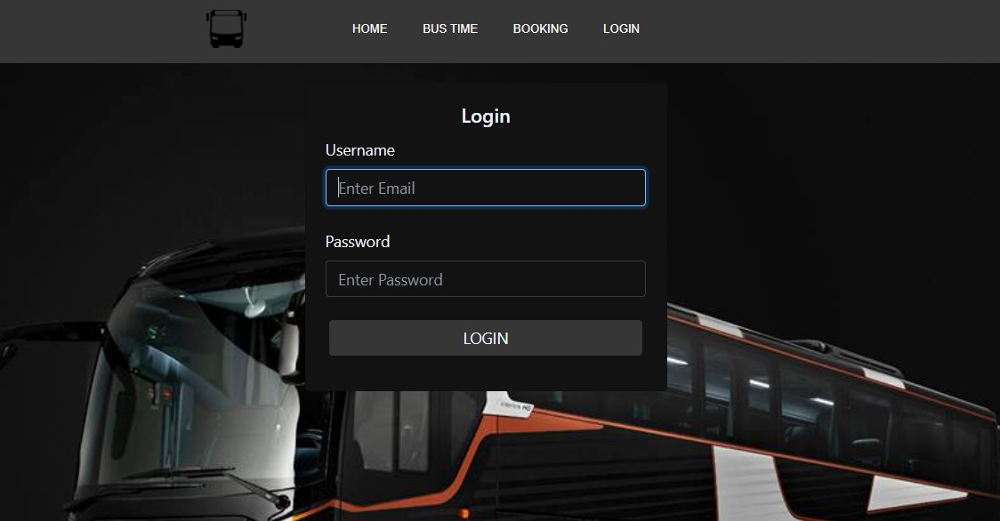
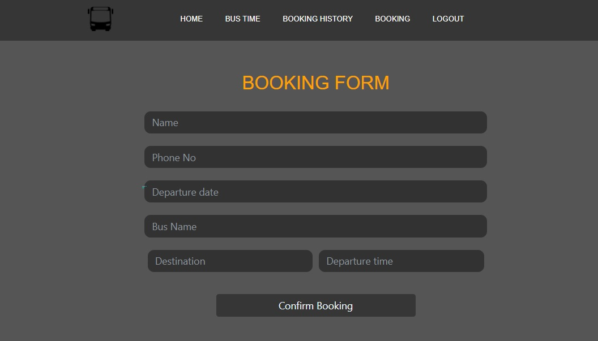
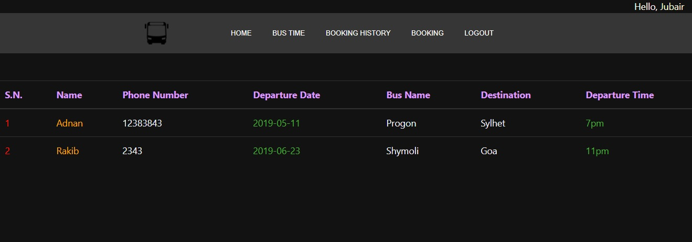

# Bus Booking System
 
This is a simple university course project. A user can book a bus for a particular destination   

------------------------------

> Frontend: Html5, CSS3, Bootstrap4 

> Backend: PHP and MySQL

-----------------------------

 

### 1. Login Screen

 

### 2. Booking form

 

### 3. View Bookings

 

 

-----------------------------

CSE311 || North South university 

